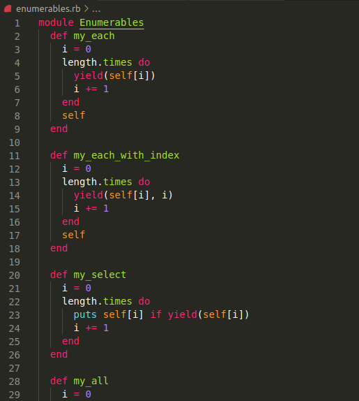

# Week 1 Enumerables

> Creating first repository with Linter, separate commits and a HTML and CSS file

## Screenshot



## Built With

- Ruby
- Linter

## Getting Started

First ensure that you have ruby installed on your local machine.

To get a local copy up and running follow these simple example steps.

## Prequisites

Ruby installed on your local machine.
Terminal or similar to execute the program.


## Install

Download a copy of the enumerables.rb file

## Usage

Execute in terminal like so ```ruby enumerables.rb```


## Authors

👤 Sergio Cortes Satizabal

- GitHub: [@githubhandle](https://github.com/sergiocortessat)
- Twitter: [@twitterhandle](https://twitter.com/sergiocortessat)

👤 Gregorio Rábago Sainz

- GitHub: [@githubhandle](https://github.com/greg0109)
- Twitter: [@twitterhandle](https://twitter.com/greg_0109)

## 🤝 Contributing

Contributions, issues, and feature requests are welcome!

Feel free to check the [issues page](https://github.com/sergiocortessat/Ruby-Milestone1-BubleSort/issues).

## Show your support

Give a ⭐️ if you like this project!

## Acknowledgments

- Hat tip to anyone whose code was used
- Inspiration
- etc

## 📝 License

This project is [MIT](LICENSE) licensed.
